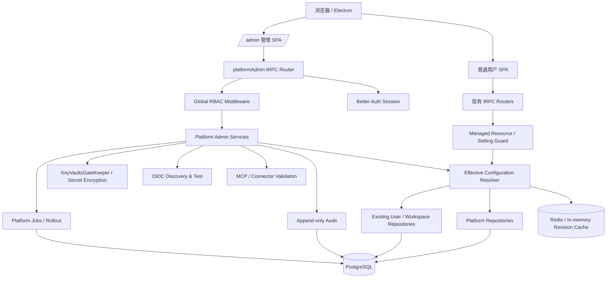

# LobeHub 企业内部版管理平台详细设计

> 目标示例平台名：**FreeHub**  
> 文档状态：设计评审稿  
> 分析日期：2026-07-15  
> 源码基线：LobeHub `2.2.10`，对应提交 `4bab1636408e60a7ee17b640490fbf33a310a325`  
> 源码来源：用户提供的 `lobehub-main.zip`，并与上游仓库版本信息交叉核验

---

## 0. 文档结论

本次二次开发不建议把“管理员”简单实现成一个前端开关，也不建议直接把某个普通用户当作全局配置的所有者。LobeHub 当前的数据模型以“用户 / 工作区拥有资源”为主，企业级全局配置需要新增独立的平台域，并通过统一的 **Effective Configuration Resolver（生效配置解析器）** 接入现有运行时。

推荐总体方案如下：

1. 新增独立入口 `/admin`，使用 LobeHub 原生 React SPA、`@lobehub/ui`、`base-ui`、`antd-style` 和既有路由体系。
2. 复用现有 RBAC 数据表，但新增平台级权限、平台角色、全局权限查询和真实的服务端鉴权中间件。
3. 新增独立的平台资源表，不使用“虚拟系统用户”承载全局 Provider、Model、Skill、Connector 或 Agent。
4. 用户设置采用“内置默认值 → 平台默认值 → 用户显式覆盖”的解析链，并增加 `user_setting_overrides`，解决当前差异存储无法可靠区分“未设置”和“显式设置”的问题。
5. Provider、Model、Skill、Connector 在企业托管模式下由管理员统一维护；用户侧移除资源配置页面和写接口，但仍允许用户在已发布资源范围内进行业务使用。对于需要每用户 OAuth 的 Connector，仅保留“授权 / 重新授权 / 断开连接”界面。
6. 管理员助理采用“平台模板 + 不可变版本 + 用户分配 / 延迟物化”的方式。默认 Lobe AI 保留内部 `inbox` 标识，管理员可修改其显示名称、头像、提示词、模型和工具；删除前必须先指定替代默认助理。
7. OIDC 登录配置存入数据库并通过管理后台维护。由于当前 Better Auth Provider 在进程启动时构建，首版采用“在线配置和测试，发布后受控滚动重启激活”的方式，不伪装成完全热更新。
8. 平台名称、Logo、页面标题、登录页、邮件和用户可见文案改为运行时 Branding 配置；包名、内部 Provider ID、数据库标识、协议标识、许可证及法定归属不做盲目替换。
9. 新增功能尽量通过企业扩展包、适配器和少数稳定挂载点接入，避免大范围修改上游核心文件。

### 0.1 必须先处理的阻断项

| 等级 | 阻断项 | 影响 | 处理要求 |
|---|---|---|---|
| P0 | 开源版 `rbacPermission` 当前是空实现 | Provider、Model 等路由虽然声明权限，实际不会执行授权判断 | 在任何管理功能上线前实现真实服务端 RBAC，并增加集成测试 |
| P0 | 现有 `RbacModel.hasPermission()` 在不传 workspace 时会匹配任意作用域 | 工作区角色可能被错误用于平台级授权 | 新增严格的 `hasGlobalPermission()`，只接受全局角色分配 |
| P0 | 仅隐藏前端入口无法阻止直接调用 API | 普通用户仍可能构造请求修改受管资源 | 导航、路由、服务端 Mutation 三层同时限制 |
| P1 | 当前设置按默认值保存差异 | 无法稳定识别用户是否显式设置某字段 | 新增按路径记录的显式覆盖表和 Patch API |
| P1 | 外部 OIDC Provider 当前在启动时由环境变量构建 | 数据库配置不能自然即时生效 | 首版明确采用“发布后滚动重启激活” |
| P1 | Branding 中存在编译期常量和大量硬编码 | 直接字符串替换会破坏内部标识和上游兼容 | 建立运行时 Branding Provider 和允许列表扫描 |
| P1 | 企业派生开发涉及源码许可证约束 | 可能影响内部部署和后续分发 | 在编码前由法务确认并完成所需商业许可 |

### 0.2 许可证提示

本地源码根目录 `LICENSE` 为 **LobeHub Community License**。其中明确说明：商业场景下，如需基于源码开发并分发派生作品，需要取得生产方商业许可；`packages/business/const/src/branding.ts` 也对商业场景修改 Branding 作了同类提示。企业内部部署是否落入具体许可范围，应由法务结合部署方式、关联主体、分发边界和商业用途判断。本设计不是法律意见，但建议把许可确认列为正式立项门禁。

---

## 1. 需求映射与验收口径

| 编号 | 原始需求 | 设计响应 | 核心验收标准 |
|---|---|---|---|
| REQ-01 | 管理后台和超级管理员 | `/admin` 独立 SPA 路由；平台 RBAC；`super_admin`；子管理员角色 | 非管理员返回 403；超级管理员具备全部平台权限；最后一名超级管理员不可被移除 |
| REQ-02 | 使用原生 UI 风格和组件 | 复用 `@lobehub/ui/base-ui`、`@lobehub/ui`、`antd-style`、既有设置组件 | 深色/浅色、键盘可达、状态完整；无新引入的不一致设计体系 |
| REQ-02.1 | 用户管理和子管理员 | 用户列表、详情、封禁、会话撤销、平台角色分配 | 所有危险操作服务端校验并写审计；角色分配按平台作用域执行 |
| REQ-02.2 | 全局配置 Provider / Model / Skill / Connector，用户侧移除配置 | 新增平台资源目录；企业托管模式；用户侧导航、路由、Mutation 关闭 | 普通用户无法新增或修改受管资源；仍可使用管理员发布的资源 |
| REQ-02.3 | 其他设置由管理员配置默认值，用户可覆盖 | 路径级策略 `user/default/locked/hidden`；显式覆盖表 | 未覆盖用户自动继承新默认值；已覆盖用户保持自己的值；锁定字段不能被 API 修改 |
| REQ-03 | 管理员为所有用户 CRUD 助理，包括 Lobe AI | 平台助理模板、版本、分配、延迟物化；`inbox` 特殊兼容 | 管理员可发布、更新、归档、回滚；用户列表可见；默认助理更换不破坏历史会话 |
| REQ-04 | 后台配置 OIDC Provider，如 Authentik | OIDC 向导、Discovery、回调地址、Claim 映射、测试、发布和激活状态 | Secret 不回显；可测试 Authentik；发布后经受控重启生效；保留应急登录通道 |
| REQ-05 | 平台名称，例如 FreeHub，替换用户可见 LobeHub | 运行时 Branding；i18n 插值；静态文案扫描；默认助理名称联动 | 登录页、导航、标题、Manifest、邮件等显示新名称；内部包名和许可证不被替换 |
| REQ-06 | 清晰好用的 UI，可复用已有 UI | 设置组件抽取为可复用 Feature；管理员增加状态、来源、发布和审计层 | 页面具备加载、空、错误、成功、冲突和只读状态；关键流程不依赖手工拼 API |
| REQ-07 | 管理面板独立 URL | `/admin` 及子路由 | 可直接深链；刷新后保持页面；无权限用户不能加载敏感数据 |
| REQ-08 | 尽量兼容上游 | 企业扩展包、适配器、有限挂载点、补丁台账、持续 Rebase CI | 核心表尽量不改；上游合并冲突集中于少量文件；可通过 Feature Flag 回退 |

---

## 2. 源码现状分析

### 2.1 技术栈与工程约束

当前源码主要技术栈：

- Next.js 16、React 19、TypeScript。
- Next.js 内承载基于 `react-router` / `react-router-dom` 的 SPA。
- UI 优先级：`@lobehub/ui/base-ui` → `@lobehub/ui` → Ant Design。
- 样式使用 `antd-style`、`createStaticStyles` 和语义化 `cssVar`。
- 客户端状态使用 Zustand，服务端数据请求使用 tRPC / SWR。
- 数据库为 PostgreSQL + Drizzle ORM。
- 认证使用 Better Auth，已启用 `admin()`、Generic OAuth、Passkey 等插件。
- 桌面 Web 与 Electron 使用两套桌面路由配置，新增路由必须保持同步。

仓库已有明确分层：

```text
src/app                     Next.js 壳层、认证入口、SSR 元数据
src/spa                     React SPA 入口与路由
src/routes                  薄路由页面
src/features                可复用业务 UI
src/business                商业版挂载点或本地 stub
apps/server                 tRPC 路由与服务端逻辑
packages/database           Drizzle Schema、Model、Repository、Migration
packages/business-server    OSS 下的商业功能 stub
packages/types              跨端类型
packages/const              常量和 RBAC 定义
```

### 2.2 可利用的路由扩展点

`src/business/client/BusinessDesktopRoutes.tsx` 已经暴露三个空数组：

```ts
BusinessDesktopRoutesWithMainLayout
BusinessDesktopRoutesWithSettingsLayout
BusinessDesktopRoutesWithoutMainLayout
```

它们分别注入到：

- `src/spa/router/desktopRouter.config.tsx`
- `src/spa/router/desktopRouter.config.desktop.tsx`

因此 `/admin` 最适合通过 `BusinessDesktopRoutesWithoutMainLayout` 挂载，避免强行嵌入普通用户主布局。需要同步扩展现有 `desktopRouter.sync.test.tsx`，防止 Web / Electron 路由漂移导致空白页。

### 2.3 UI 复用基础

已有设置页面可作为管理员页面的视图基础：

```text
src/routes/(main)/settings/provider
src/routes/(main)/settings/service-model
src/routes/(main)/settings/skill
src/routes/(main)/settings/connector
```

工作区设置页已经复用个人设置页的一部分：

```text
src/routes/(main)/[workspaceSlug]/settings/provider
src/routes/(main)/[workspaceSlug]/settings/service-model
src/routes/(main)/[workspaceSlug]/settings/skill
src/routes/(main)/[workspaceSlug]/settings/connector
```

这证明 Provider、Model、Skill、Connector UI 可以继续抽取成独立 Feature。需要避免管理员页面长期直接 import 路由页，应把呈现层和领域交互层抽到 `src/features` 或企业 Client Package，再由个人、工作区、管理员三个路由适配。

### 2.4 RBAC 现状

已有数据表：

- `rbac_roles`
- `rbac_permissions`
- `rbac_role_permissions`
- `rbac_user_roles`

`workspace_id` 允许为空，因此可表示全局角色；常量中也已经存在 `super_admin`。这是构建平台 RBAC 的良好基础。

但存在两个关键问题：

1. `packages/business-server/src/trpc-middlewares/rbacPermission.ts` 在 OSS 构建中是明确的 no-op，所有权限检查直接 `opts.next()`。
2. `RbacModel.hasPermission()` 在不传 `workspaceId` 时匹配用户在任意作用域中的角色。平台权限必须新增“只匹配 `workspace_id IS NULL`”的查询，否则可能产生权限提升。

另一个需要避免的现有 API 是 `RbacModel.updateUserRoles(userId, roleIds)`：它会删除用户全部角色分配，不区分平台与工作区。管理员后台必须实现按作用域替换的专用方法，不得直接复用该方法。

### 2.5 用户设置现状

`user_settings` 每个用户一行，主要字段为 JSONB：

```text
tts / hotkey / general / language_model / system_agent / default_agent
market / memory / tool / image / notification
```

当前前端通过以下方式得到最终设置：

```ts
currentSettings = merge(defaultSettings, userSettings)
```

保存时则计算相对于默认值的差异：

```ts
diffs = difference(nextSettings, defaultSettings)
```

这为“管理员默认值”提供了基础，但还不够：

- 关键设置只在客户端合并，服务端运行时不一定得到同一结果。
- `UserSettingsSchema` 顶层大量使用 `z.any()`，不能作为企业策略写入边界。
- 无法可靠区分“用户没设置”和“用户显式设置成恰好等于默认值”。
- 当前 `resetSettings` 会删除整行，无法精确重置一个路径。

因此必须增加服务端解析器、路径级 Schema Registry 和显式覆盖记录。

### 2.6 AI Provider / Model 现状

`ai_providers` 和 `ai_models` 都要求 `user_id NOT NULL`，并可选 `workspace_id`。当前 Repository 会合并：

1. 内置 Model Bank。
2. 环境变量 / Server Config。
3. 用户或工作区数据库配置。

这套模型适合个人和工作区，不适合平台全局资源。若通过创建“系统用户”承载全局配置，会带来级联删除、唯一索引、审计归属、权限语义和后续迁移问题，因此不采用。

Provider / Model 路由已经声明 `withScopedPermission()`，但在当前 OSS 构建中该中间件为空实现。因此企业托管模式必须先替换真实权限实现，再关闭普通用户写入。

### 2.7 Skill 现状

`agent_skills` 同样以用户 / 工作区为所有者，来源包括 `builtin`、`market` 和 `user`。企业模式需要单独的平台 Skill Catalog、版本和发布状态，并在运行时与内置 Skill 合并。

### 2.8 Connector 现状

`user_connectors` 同时包含：

- Connector 定义。
- MCP 地址或 stdio 配置。
- OIDC / OAuth Client 配置。
- 用户凭据或 OAuth Token。
- Tool 权限。

当前 Connector 路由主要做所有者隔离，没有平台级 RBAC。企业管理要求必须把“平台定义”和“用户授权绑定”拆开：管理员定义 Endpoint、工具、策略和凭据模式；用户仅在需要时完成个人 OAuth 授权。

需要特别区分：Connector Schema 中的 `oidcConfig` 是 MCP Connector 授权配置，不是平台登录 OIDC Provider。

### 2.9 Agent 与默认 Lobe AI 现状

`agents` 表同样要求 `user_id NOT NULL`。默认 Lobe AI 的关键兼容标识为：

- 内部 slug：`inbox`
- 默认显示名：`Lobe AI`
- 默认头像：`/avatars/lobe-ai.png`

默认 Agent 会在需要时延迟创建，并带有兼容归一化逻辑。企业版不能简单重命名内部 slug，也不应对全量用户同步改写 Agent 行。平台模板和用户实体需要分层。

### 2.10 外部登录 OIDC 现状

仓库已有 Authentik、Generic OIDC、Keycloak、Okta 等定义。Authentik 目前通过以下环境变量配置：

```text
AUTH_SSO_PROVIDERS
AUTH_AUTHENTIK_ID
AUTH_AUTHENTIK_SECRET
AUTH_AUTHENTIK_ISSUER
```

`initBetterAuthSSOProviders()` 在 `define-config.ts` 初始化阶段执行，Provider 列表被传入 Better Auth Plugin。由此可见，当前认证 Provider 属于启动时配置。

另外，`packages/database/src/schemas/oidc.ts` 描述的是“LobeHub 作为 OIDC Provider”时的 Client、Session 和 Consent 数据，并不是外部企业 IdP 配置，不能直接复用。

### 2.11 Branding 现状

`packages/business/const/src/branding.ts` 包含：

- `BRANDING_NAME = 'LobeHub'`
- `ORG_NAME = 'LobeHub'`
- Logo、URL、邮箱、社交链接等。

部分 UI 已通过 `ProductLogo`、`OrgBrand` 等组件集中显示，但仍存在大量硬编码字符串；Better Auth Passkey 的 `rpName` 也直接写为 `LobeHub`。因此需要建立运行时 Branding，同时保留少量启动时激活项。

---

## 3. 总体设计原则

### 3.1 平台域与用户域分离

企业全局资源必须有独立所有权、生命周期和审计主体。禁止使用以下方案：

- 创建一个隐藏“系统用户”持有全部资源。
- 把全局配置写进某个超级管理员个人设置。
- 只在客户端 Store 中注入默认值。
- 通过 CSS 或菜单隐藏代替服务端授权。

### 3.2 发布而不是即时生效

影响全体用户的配置采用统一生命周期：

```text
Draft → Validate/Test → Preview → Publish → Activate → Rollback
```

管理员每次键入不应立即影响全站。Provider、Model、Skill、Connector、Agent、Settings、OIDC 和 Branding 都使用版本号、乐观锁和发布记录。

### 3.3 服务端为唯一可信执行点

客户端策略只负责体验，真正约束必须在服务端完成：

- 权限判断。
- 设置继承。
- 受管字段写入拦截。
- Provider / Model 运行时选择。
- Connector Tool 权限。
- Agent 托管字段限制。
- Secret 脱敏。

### 3.4 兼容优先

优先新增表、Repository 和 Adapter，避免重写上游核心表含义。所有上游触点集中记录，并通过 Feature Flag 可快速回退。

### 3.5 稳定内部标识，动态用户可见名称

以下标识不得随平台名修改：

- npm 包名和 import 路径，如 `@lobehub/*`。
- 默认 Agent slug `inbox`。
- 数据库表名和协议 ID。
- 内部 Provider ID，例如确有业务含义的 `lobehub`。
- 仓库链接、许可证、第三方归属。

用户可见名称、Logo、页面标题、邮件名称和文案由 Branding 配置控制。

---

## 4. 目标架构



### 4.1 逻辑模块

```text
enterprise-admin-client
  ├─ routes
  ├─ layout
  ├─ pages
  ├─ components
  ├─ stores
  └─ api adapters

enterprise-admin-server
  ├─ platformAdminRouter
  ├─ middleware/globalPermission
  ├─ services
  ├─ resolvers
  ├─ jobs
  ├─ audit
  └─ secret redaction

enterprise-admin-database
  ├─ schemas
  ├─ models
  ├─ repositories
  ├─ migrations
  └─ seeds

enterprise-admin-common
  ├─ permission constants
  ├─ zod schemas
  ├─ DTOs
  ├─ setting registry
  └─ error codes
```

### 4.2 建议目录方案

推荐建立独立 Package，最大限度减少上游冲突：

```text
packages/enterprise-admin-common
packages/enterprise-admin-database
packages/enterprise-admin-server
packages/enterprise-admin-client
```

并新增 package-first alias：

```json
{
  "paths": {
    "@/enterprise/common/*": [
      "./packages/enterprise-admin-common/src/*",
      "./src/enterprise/common/*"
    ],
    "@/enterprise/server/*": [
      "./packages/enterprise-admin-server/src/*",
      "./src/enterprise/server/*"
    ],
    "@/enterprise/client/*": [
      "./packages/enterprise-admin-client/src/*",
      "./src/enterprise/client/*"
    ]
  }
}
```

也可以沿用现有 `@/business/server/*` 覆盖机制，但建议把企业内部功能与上游商业版 Stub 分开命名，降低未来语义冲突。

---

## 5. 管理后台路由与信息架构

### 5.1 路由表

| 路由 | 页面 | 主要权限 |
|---|---|---|
| `/admin` | 控制台概览 | `platform_admin:access:all` |
| `/admin/users` | 用户列表 | `platform_user:read:all` |
| `/admin/users/:userId` | 用户详情 | `platform_user:read:all` |
| `/admin/roles` | 角色和权限 | `platform_role:read:all` |
| `/admin/ai/providers` | AI 服务商 | `platform_provider:read:all` |
| `/admin/ai/providers/:providerId` | 服务商详情 | `platform_provider:read:all` |
| `/admin/ai/models` | 服务模型 | `platform_model:read:all` |
| `/admin/skills` | Skill 管理 | `platform_skill:read:all` |
| `/admin/connectors` | Connector 管理 | `platform_connector:read:all` |
| `/admin/agents` | 平台助理 | `platform_agent:read:all` |
| `/admin/agents/:agentId` | 助理编辑 / 版本 / 分发 | `platform_agent:read:all` |
| `/admin/settings/defaults` | 平台默认设置 | `platform_settings:read:all` |
| `/admin/auth/oidc` | 外部 OIDC | `platform_oidc:read:all` |
| `/admin/branding` | 平台 Branding | `platform_branding:read:all` |
| `/admin/audit` | 审计日志 | `platform_audit:read:all` |
| `/admin/system` | 系统版本、Job、健康状态 | `platform_system:read:all` |

### 5.2 路由挂载

建议由企业 Client Package 导出：

```ts
export const EnterpriseDesktopRoutesWithoutMainLayout: RouteObject[] = [
  {
    path: '/admin',
    lazy: () => import('./routes/AdminRoot'),
    children: [/* ... */],
  },
];
```

然后通过现有 `BusinessDesktopRoutesWithoutMainLayout` 或新增一个明确的 Enterprise Route Seam 注入两套桌面路由。

### 5.3 路由保护

加载顺序：

1. 检查 Better Auth Session。
2. 调用 `platformAdmin.me.getCapabilities`。
3. 无 Session：跳转 `/signin?redirect=/admin/...`。
4. 有 Session 但无 `platform_admin:access:all`：渲染统一 403。
5. 有基础访问权但无页面权限：隐藏导航项，同时页面 Loader 返回 403。
6. 任何数据查询和 Mutation 仍在服务端再次检查权限。

禁止仅根据前端 `user.role` 判断管理员。

### 5.4 移动端策略

管理后台首版定位为桌面优先：

- 宽度不足时保留只读概览或显示“请使用桌面端管理”。
- 不在首版为复杂表格、Secret 和 OIDC Wizard 制作完整移动交互。
- 普通用户移动端不受影响。

---

## 6. 管理后台 UI 设计

### 6.1 布局

```text
┌─────────────────────────────────────────────────────────┐
│ Platform Logo / Name                Search   User Menu  │
├──────────────┬──────────────────────────────────────────┤
│ Overview     │ Breadcrumb / Page title / Primary action │
│ Users        │                                          │
│ Access       │ Page content                             │
│ AI Infra     │                                          │
│ Agents       │                                          │
│ Auth         │                                          │
│ Branding     │                                          │
│ Audit        │                                          │
└──────────────┴──────────────────────────────────────────┘
```

- 左侧导航使用现有侧边导航视觉语言。
- 页面标题区最多一个主操作，例如“新建 Provider”或“发布配置”。
- 次级操作进入 Dropdown 或页面右侧工具区。
- 详情优先使用独立路由；快速检查可使用 Drawer。
- 危险操作使用 `confirmModal`，显示影响范围和明确资源名称。

### 6.2 组件优先级

1. `@lobehub/ui/base-ui`
2. `@lobehub/ui`
3. Ant Design，仅用于确实缺少的复杂 Table / Form 能力

样式要求：

- `createStaticStyles`。
- `cssVar` 语义 Token。
- 4px 间距体系。
- 卡片内边距 16–24px。
- 控件高度与现有设置页保持一致。
- 不写固定浅色 / 深色背景。
- 所有交互元素有可见 Focus Ring。

### 6.3 通用状态

每个页面必须实现：

- Skeleton 加载。
- 无数据 Empty State。
- 首次配置引导。
- Query 错误和重试。
- Mutation 成功 Toast。
- Revision Conflict 冲突提示。
- 只读 / 权限不足状态。
- Secret 已配置但不回显状态。
- Draft、Published、Pending Restart、Archived、Error 等状态 Badge。

### 6.4 现有 UI 复用改造

建议从现有路由页中抽取以下 Feature：

```text
src/features/AIProviderSettings
src/features/ServiceModelCatalog
src/features/ToolCatalog
src/features/ManagedAgentEditor
src/features/SettingsSchemaEditor
```

每个 Feature 不直接假设资源属于当前用户，而是依赖 Adapter：

```ts
interface ProviderSettingsAdapter {
  list(): Promise<Provider[]>;
  get(id: string): Promise<ProviderDetail>;
  create(input: CreateProviderInput): Promise<void>;
  update(id: string, input: UpdateProviderInput): Promise<void>;
  remove(id: string): Promise<void>;
  capabilities: ProviderUICapabilities;
}
```

个人、工作区、平台分别注入不同 Adapter 和 Capability。这样可以最大程度复用视图，而不混用权限和数据源。

---

## 7. 平台 RBAC 与超级管理员

### 7.1 权限模型

平台权限使用独立命名空间，并统一为全局 `:all` 作用域：

```text
platform_admin:access:all
platform_user:read:all
platform_user:update:all
platform_user:ban:all
platform_user:delete:all
platform_user:session_revoke:all
platform_role:read:all
platform_role:update:all
platform_provider:read:all
platform_provider:create:all
platform_provider:update:all
platform_provider:delete:all
platform_provider:publish:all
platform_model:read:all
platform_model:create:all
platform_model:update:all
platform_model:delete:all
platform_model:publish:all
platform_skill:read:all
platform_skill:create:all
platform_skill:update:all
platform_skill:delete:all
platform_skill:publish:all
platform_connector:read:all
platform_connector:create:all
platform_connector:update:all
platform_connector:delete:all
platform_connector:publish:all
platform_agent:read:all
platform_agent:create:all
platform_agent:update:all
platform_agent:delete:all
platform_agent:publish:all
platform_agent:rollout:all
platform_settings:read:all
platform_settings:update:all
platform_settings:publish:all
platform_oidc:read:all
platform_oidc:update:all
platform_oidc:test:all
platform_oidc:publish:all
platform_branding:read:all
platform_branding:update:all
platform_branding:publish:all
platform_audit:read:all
platform_audit:export:all
platform_system:read:all
platform_secret:rotate:all
```

### 7.2 内置角色

| 角色 | 用途 | 可委派 |
|---|---|---|
| `super_admin` | 全部平台权限、角色和安全配置 | 否；只能由超级管理员授予 |
| `platform_admin` | 日常平台管理，不默认包含超级管理员委派和 Secret Rotation | 是 |
| `user_admin` | 用户、封禁、会话、基础角色分配 | 是 |
| `ai_admin` | Provider、Model、Skill、Connector、Agent | 是 |
| `security_admin` | OIDC、会话、审计、Secret Rotation | 谨慎委派 |
| `auditor` | 只读审计和系统状态 | 是 |

首版允许一个用户拥有多个角色。后续可开放自定义角色，但系统角色本身不可删除或改名。

### 7.3 全局权限查询

新增严格方法：

```ts
hasGlobalPermission(userId, permissionCode)
getGlobalPermissions(userId)
getGlobalRoles(userId)
replaceGlobalRoles(userId, roleIds)
```

SQL 约束必须同时包括：

```sql
rbac_user_roles.workspace_id IS NULL
AND rbac_roles.workspace_id IS NULL
AND rbac_roles.is_active = TRUE
AND rbac_permissions.is_active = TRUE
AND (expires_at IS NULL OR expires_at > NOW())
```

不能复用“不传 workspaceId”的现有 `hasPermission()` 语义。

### 7.4 管理员 Procedure

```ts
const platformAdminProcedure = authedProcedure
  .use(serverDatabase)
  .use(requirePlatformAccess);

const withPlatformPermission = (permission: PlatformPermission) =>
  trpc.middleware(async ({ ctx, next }) => {
    const allowed = await ctx.globalRbac.hasGlobalPermission(ctx.userId, permission);
    if (!allowed) throw new TRPCError({ code: 'FORBIDDEN' });
    return next();
  });
```

默认拒绝；权限失败不返回资源是否存在，避免枚举。

### 7.5 超级管理员初始化

新增环境变量：

```text
ENABLE_PLATFORM_ADMIN=1
PLATFORM_SUPER_ADMIN_EMAILS=admin1@example.com,admin2@example.com
```

流程：

1. Migration / Seed 幂等创建平台权限和系统角色。
2. 用户登录或启动 Seed 时，按规范化邮箱匹配。
3. 创建全局 `rbac_user_roles` 记录。
4. 写入 `platform_audit_logs`。
5. 后续移除环境变量不会自动撤销已授予角色。

也可支持显式 User ID，避免邮箱变更：

```text
PLATFORM_SUPER_ADMIN_USER_IDS=...
```

### 7.6 最后一名超级管理员保护

以下操作都必须在事务中检查：

- 删除超级管理员角色。
- 封禁超级管理员。
- 删除用户。
- 设置角色过期。
- 停用 `super_admin` 角色。

使用行锁或 PostgreSQL Advisory Lock，确保并发请求不能同时移除两名管理员。若操作会导致活跃超级管理员数量为 0，返回 `LAST_SUPER_ADMIN`。

### 7.7 Better Auth 的定位

Better Auth 已启用 `admin()`，用户表也已有 `role`、`banned`、`banReason`、`banExpires`。建议：

- 平台授权的唯一事实源：RBAC 表。
- `users.role` 只作为 Better Auth 兼容字段或粗粒度镜像，不作为业务授权依据。
- 封禁、会话撤销等操作通过封装后的 Auth Admin Service 执行。
- Auth Admin Service 外层必须先做平台 RBAC 和审计。
- 不维护两套独立、可能漂移的角色体系。

---

## 8. 数据模型

### 8.1 数据模型总览

```mermaid
erDiagram
  USERS ||--o{ RBAC_USER_ROLES : has
  RBAC_ROLES ||--o{ RBAC_USER_ROLES : assigned
  RBAC_ROLES ||--o{ RBAC_ROLE_PERMISSIONS : grants
  RBAC_PERMISSIONS ||--o{ RBAC_ROLE_PERMISSIONS : contains

  USERS ||--o{ USER_SETTING_OVERRIDES : overrides
  PLATFORM_SETTING_POLICIES ||--o{ USER_SETTING_OVERRIDES : governs

  PLATFORM_AI_PROVIDERS ||--o{ PLATFORM_AI_MODELS : contains
  PLATFORM_CONNECTORS ||--o{ PLATFORM_CONNECTOR_TOOLS : exposes
  PLATFORM_CONNECTORS ||--o{ PLATFORM_USER_CONNECTOR_BINDINGS : binds
  USERS ||--o{ PLATFORM_USER_CONNECTOR_BINDINGS : authorizes

  PLATFORM_AGENTS ||--o{ PLATFORM_AGENT_VERSIONS : versions
  PLATFORM_AGENTS ||--o{ PLATFORM_AGENT_ASSIGNMENTS : assigns
  USERS ||--o{ PLATFORM_AGENT_ASSIGNMENTS : receives
  AGENTS ||--o| PLATFORM_AGENT_ASSIGNMENTS : materializes

  PLATFORM_IDENTITY_PROVIDERS ||--o{ PLATFORM_RESOURCE_REVISIONS : revisions
  PLATFORM_BRANDING ||--o{ PLATFORM_RESOURCE_REVISIONS : revisions
  USERS ||--o{ PLATFORM_AUDIT_LOGS : acts
  USERS ||--o{ PLATFORM_JOBS : requests
```



### 8.2 通用版本表

#### `platform_resource_revisions`

用于保存所有全局资源发布前后的不可变快照：

| 字段 | 类型 | 说明 |
|---|---|---|
| `id` | text / uuid | 主键 |
| `resource_type` | varchar | settings/provider/model/skill/connector/agent/oidc/branding |
| `resource_id` | text | 资源 ID |
| `version` | integer | 单资源递增版本 |
| `status` | varchar | draft/published/archived/rolled_back |
| `payload` | jsonb | 已脱敏业务配置快照 |
| `secret_fingerprint` | text | Secret 指纹，不存明文 |
| `comment` | text | 发布说明 |
| `created_by` | text | 创建人 |
| `published_by` | text | 发布人 |
| `created_at` | timestamptz | 创建时间 |
| `published_at` | timestamptz | 发布时间 |

唯一索引：`(resource_type, resource_id, version)`。

运行时仍查询规范化的当前表；Revision 表用于回滚、Diff 和审计。

### 8.3 平台设置表

#### `platform_setting_policies`

| 字段 | 类型 | 说明 |
|---|---|---|
| `path` | text PK | 例如 `general.language` |
| `mode` | varchar | `user/default/locked/hidden` |
| `value` | jsonb | 平台默认或强制值 |
| `schema_version` | integer | 设置定义版本 |
| `config_revision` | integer | 当前发布版本 |
| `updated_by` | text | 管理员 |
| `updated_at` | timestamptz | 更新时间 |

#### `user_setting_overrides`

| 字段 | 类型 | 说明 |
|---|---|---|
| `user_id` | text | 用户 |
| `path` | text | 设置路径 |
| `value` | jsonb | 用户显式值 |
| `source` | varchar | user/import/migration/admin_reset |
| `updated_at` | timestamptz | 更新时间 |

主键：`(user_id, path)`。

该表不要求一次迁移所有旧设置。首版只接管管理员允许配置的平台路径，其他路径继续存于 `user_settings`。

### 8.4 AI Provider 表

#### `platform_ai_providers`

| 字段 | 类型 | 说明 |
|---|---|---|
| `id` | varchar(64) PK | Provider ID |
| `display_name` | text | 显示名 |
| `description` | text | 描述 |
| `logo` | text | Logo |
| `source` | varchar | builtin/custom/environment |
| `enabled` | boolean | 是否启用 |
| `fetch_on_client` | boolean | 共享 Secret 场景通常为 false |
| `check_model` | text | 连通性检查模型 |
| `settings` | jsonb | 非 Secret 设置 |
| `config` | jsonb | Base URL、Header 模板等 |
| `encrypted_key_vaults` | text | 加密凭据 |
| `secret_key_version` | integer | 加密密钥版本 |
| `secret_updated_at` | timestamptz | Secret 最近更新时间 |
| `sort` | integer | 排序 |
| `status` | varchar | draft/published/disabled |
| `revision` | integer | 乐观锁版本 |
| `created_by/updated_by` | text | 审计字段 |
| `created_at/updated_at` | timestamptz | 时间 |

API 永不返回 `encrypted_key_vaults`，只返回：

```ts
{
  hasSecret: boolean;
  secretUpdatedAt?: string;
  secretFingerprint?: string;
}
```

### 8.5 AI Model 表

#### `platform_ai_models`

核心字段与现有 `ai_models` 保持接近，去掉 `user_id/workspace_id`，增加：

- `provider_id`
- `status`
- `revision`
- `created_by/updated_by`
- `published_at`

唯一键：`(provider_id, id)`。

建议保留现有能力、Pricing、Context Window、Parameters、Settings 结构，降低 Adapter 成本。

### 8.6 Skill 表

#### `platform_skills`

| 字段 | 说明 |
|---|---|
| `id/identifier/name/description` | 基本信息 |
| `source` | builtin/market/uploaded |
| `distribution` | mandatory/default/optional |
| `enabled` | 是否发布给用户 |
| `current_version` | 当前版本 |
| `status/revision` | 生命周期 |
| `manifest` | 当前 Manifest 摘要 |
| `created_by/updated_by` | 审计 |

#### `platform_skill_versions`

存储不可变 Manifest、Content、Resource Metadata、ZIP Hash、文件引用和校验结果。

### 8.7 Connector 表

#### `platform_connectors`

| 字段 | 说明 |
|---|---|
| `id/identifier/name` | 基本信息 |
| `source_type` | builtin/custom/marketplace |
| `connection_type` | http/cloud/stdio |
| `mcp_server_url` | Endpoint |
| `mcp_stdio_config` | 仅允许受信部署环境 |
| `credential_mode` | none/shared_service_account/per_user_oauth |
| `oidc_config` | OAuth Client / Discovery 配置，Secret 脱敏 |
| `encrypted_shared_credentials` | 共享服务账号凭据 |
| `is_required` | 是否强制显示 |
| `enabled/status/revision` | 生命周期 |

#### `platform_connector_tools`

- `connector_id`
- `tool_name`
- `manifest`
- `permission_policy`：`auto / needs_approval / disabled`
- `allow_user_stricter_policy`
- `limit_config`

#### `platform_user_connector_bindings`

仅存每用户授权状态和 Token：

- `platform_connector_id`
- `user_id`
- `auth_status`
- `encrypted_credentials`
- `expires_at`
- `last_error`
- `connected_at`

### 8.8 平台 Agent 表

#### `platform_agents`

| 字段 | 说明 |
|---|---|
| `id` | 平台模板 ID |
| `system_key` | 稳定系统键，例如 `default-inbox` |
| `slug` | 平台模板 slug；默认助理仍映射到 `inbox` |
| `title/description/avatar/background_color/tags` | 元数据 |
| `provider/model/system_role/params/plugins` | Agent 配置 |
| `chat_config/agency_config/opening_*` | 交互配置 |
| `distribution` | mandatory/default/optional |
| `edit_policy` | locked/clone_on_edit/user_override |
| `delete_policy` | forbidden/hideable/deletable |
| `pin_policy` | required/default/user |
| `is_default` | 是否全局默认 |
| `status/current_version/revision` | 生命周期 |

#### `platform_agent_versions`

保存每次发布的完整不可变 Agent 配置和依赖校验结果。

#### `platform_agent_assignments`

| 字段 | 说明 |
|---|---|
| `platform_agent_id` | 模板 |
| `user_id` | 用户 |
| `materialized_agent_id` | 对应现有 `agents.id`，可为空 |
| `installed_version` | 已安装版本 |
| `status` | pending/active/hidden/error |
| `user_overlay` | 允许的用户覆盖路径 |
| `last_synced_at/last_error` | 同步状态 |

### 8.9 外部 OIDC 表

#### `platform_identity_providers`

| 字段 | 说明 |
|---|---|
| `id` | 主键 |
| `provider_key` | 稳定 callback key，例如 `corp-authentik` |
| `type` | oidc |
| `display_name/button_label/icon` | 登录页显示 |
| `issuer/discovery_url` | OIDC 元数据 |
| `client_id` | Client ID |
| `encrypted_client_secret` | 加密 Secret |
| `scopes` | scopes |
| `use_pkce` | PKCE |
| `claim_mapping` | sub/email/name/groups |
| `domain_allowlist` | 邮箱域限制 |
| `auto_provision` | JIT 用户创建 |
| `group_role_mapping` | IdP Group → 平台角色 |
| `status` | draft/published/pending_restart/active/error/disabled |
| `revision` | 版本 |

### 8.10 Branding 表

#### `platform_branding`

单例当前配置：

- `display_name`
- `short_name`
- `legal_name`
- `logo_url`
- `icon_url`
- `favicon_url`
- `og_image_url`
- `support_url`
- `home_url`
- `privacy_url`
- `terms_url`
- `email_sender_name`
- `email_from`
- `page_title_template`
- `default_agent_display_name`
- `theme_defaults`
- `status/revision`

Logo 等资产建议上传到现有对象存储，并保存内部受控 URL。

### 8.11 审计表

#### `platform_audit_logs`

- `id`
- `actor_user_id`
- `action`
- `resource_type`
- `resource_id`
- `result`
- `reason`
- `request_id`
- `ip_hash`
- `user_agent`
- `before_diff`
- `after_diff`
- `config_revision`
- `created_at`

要求：

- Secret、Token、Authorization Header、Cookie、完整 KeyVault 永不进入 Diff。
- 表默认只允许 Insert / Select；普通应用角色无 Update / Delete 权限。
- 保留策略由独立维护任务执行。

### 8.12 Job 表

#### `platform_jobs`

用于全量 Agent 分发、批量角色操作、Connector 同步等：

- `id/type/status`
- `input`
- `progress_total/progress_done`
- `cursor`
- `result_summary`
- `last_error`
- `requested_by`
- `started_at/finished_at`
- `retry_count`

所有 Job 必须幂等、可重试、可从 Cursor 恢复。

---

## 9. 设置默认值、继承与锁定

### 9.1 策略模式

| 模式 | 管理员值 | 用户是否可改 | 用户 UI | 运行时 |
|---|---|---|---|---|
| `user` | 无 | 是 | 正常 | 使用内置默认或用户值 |
| `default` | 有 | 是 | 显示“组织默认值” | 用户未显式覆盖时使用管理员值 |
| `locked` | 有 | 否 | 显示但禁用，标记“由管理员管理” | 始终使用管理员值 |
| `hidden` | 有或禁用值 | 否 | 不显示该设置 | 始终使用管理员值或禁用值 |

### 9.2 生效优先级

```text
内置代码默认值
  ↓
环境变量 / Bootstrap 默认值
  ↓
已发布的平台默认值
  ↓
未来可选：工作区默认值
  ↓
用户显式覆盖
```

但 `locked` 和 `hidden` 会屏蔽用户覆盖。

### 9.3 解析算法

```ts
function resolveSetting(path, context) {
  const builtin = registry.get(path).builtInDefault;
  const bootstrap = envDefaults.get(path) ?? MISSING;
  const policy = platformPolicies.get(path);
  const userOverride = userOverrides.get(path);

  const base = bootstrap !== MISSING ? bootstrap : builtin;

  if (!policy || policy.mode === 'user') {
    return userOverride.exists ? userOverride.value : base;
  }

  if (policy.mode === 'default') {
    return userOverride.exists ? userOverride.value : policy.value;
  }

  if (policy.mode === 'locked' || policy.mode === 'hidden') {
    return policy.value;
  }
}
```

返回用户端的数据结构：

```ts
interface EffectiveSettingsPayload {
  effectiveSettings: UserSettings;
  policies: Record<SettingPath, {
    mode: 'user' | 'default' | 'locked' | 'hidden';
    source: 'builtin' | 'environment' | 'platform' | 'user';
    canOverride: boolean;
  }>;
  configRevision: number;
}
```

### 9.4 设置定义注册表

不能让管理员编辑任意 JSON 路径。新增 allowlist Registry：

```ts
interface SettingDefinition<T> {
  path: string;
  titleKey: string;
  descriptionKey: string;
  control: 'switch' | 'select' | 'number' | 'text' | 'json';
  schema: z.ZodType<T>;
  builtInDefault: T;
  allowedModes: SettingPolicyMode[];
  sensitive: boolean;
  clientVisible: boolean;
  restartRequired?: boolean;
}
```

Provider Secret、OIDC Secret、Connector Token 等敏感配置不得进入普通设置 Registry。

### 9.5 写入 API

普通用户使用路径级 API：

```text
userSettings.patchOverride({ path, value })
userSettings.resetOverride({ path })
userSettings.patchOverrides({ operations[] })
```

服务端流程：

1. 在 Registry 中查找路径。
2. 校验值 Schema。
3. 读取当前发布策略。
4. 若 `locked/hidden`，返回 `SETTING_MANAGED_BY_ADMIN`。
5. 写入 / 删除 `user_setting_overrides`。
6. 使用户生效设置缓存失效。
7. 写入轻量用户设置审计或结构化日志。

### 9.6 保留被锁定前的用户值

默认策略为：管理员锁定时不删除用户原覆盖。这样以后解除锁定，用户原选择会恢复。

对安全敏感设置，可提供显式“锁定并清除所有用户覆盖”操作：

- 必须单独权限。
- 显示影响人数。
- 使用异步 Job。
- 不可与普通发布动作默认绑定。

### 9.7 UI 设计

管理员默认设置页：

- 左侧按 General、Memory、Tool、Image、TTS 等分类。
- 支持按名称和路径搜索。
- 每项有模式 Select、值编辑器、内置默认值、影响人数。
- 右侧提供“以某用户身份预览生效值”，仅做配置解析预览，不进行账号模拟登录。
- 发布前显示 Diff：新增默认、锁定、解除锁定、隐藏和潜在影响用户数。

用户设置页：

- `default`：在控件下显示“默认由组织设置，可自行修改”。
- `locked`：控件禁用，显示管理员管理图标和说明。
- `hidden`：导航和控件均不存在。
- “恢复默认值”实际删除 override 行，不写入当前默认值。

### 9.8 示例

| 路径 | 策略 | 平台值 | 结果 |
|---|---|---|---|
| `general.language` | default | `zh-CN` | 新用户默认中文，用户可改英文 |
| `memory.enabled` | locked | `true` | 所有用户强制启用，API 也不可关闭 |
| `tool.humanIntervention.approvalMode` | default | `manual` | 用户未改时采用手动审批 |
| `languageModel` | hidden | 不适用 | 个人 Provider 配置页和写接口关闭，模型由平台目录提供 |

---

## 10. 普通用户侧受管资源策略

对 Provider、Model、Skill、Connector 的“移除配置”必须做三层控制。

### 10.1 导航层

调整：

```text
src/routes/(main)/settings/hooks/useCategory.tsx
相关移动端设置分类
工作区设置分类
```

从服务端获取 `platformCapabilities`，对以下分类做条件渲染：

- Provider
- Service Model
- Skill
- Connector

不要使用前端常量作为最终判断。

### 10.2 路由层

即使用户直接访问旧地址，也必须由 Route Loader 检查策略：

- 企业托管模式：跳转到“由管理员管理”说明页，或返回 404。
- Connector 若存在每用户 OAuth：跳转到简化的“连接账户”页。
- 管理员仍通过 `/admin` 访问平台管理页，不复用个人 URL。

### 10.3 服务端 Mutation 层

以下 Mutation 在托管模式下拒绝普通用户：

- 创建、更新、删除 Provider。
- 创建、更新、删除或排序 Model。
- 上传、安装、移除 Skill。
- 创建、编辑 Endpoint、删除 Connector。
- 修改平台 Connector Tool Policy。

统一错误：

```text
RESOURCE_MANAGED_BY_PLATFORM
```

查询仍返回用户可用的已发布 Catalog，而不是空数据。

### 10.4 选择与配置的区别

用户侧可以保留：

- 在 Agent 中选择管理员允许的 Provider / Model。
- 使用管理员发布的 Skill。
- 授权需要个人 OAuth 的 Connector。
- 在平台策略允许时，对 Tool 使用做更严格的审批。

用户侧不能：

- 填写全局 API Key 或 Base URL。
- 新增任意模型。
- 安装未审核 Skill。
- 修改 MCP Endpoint 或提升 Tool 权限。

管理员可以通过设置策略进一步锁定默认 Provider / Model。

---

## 11. 用户管理

### 11.1 用户列表

字段：

- Avatar、姓名、邮箱、用户名。
- 状态：Active / Banned / Pending。
- 平台角色。
- 注册时间。
- 最近活动时间。
- 已启用认证方式。

功能：

- 搜索姓名、邮箱、用户名。
- 状态和角色筛选。
- Cursor 分页。
- URL 保存筛选条件。
- 单用户和有界批量操作。

索引建议：

- `lower(email)`。
- `lower(username)`。
- `last_active_at`。
- `created_at`。
- 条件索引 `banned = true` 已存在，可继续利用。

### 11.2 用户详情

Tab：

1. **Profile**：基础资料、注册时间、最近活动。
2. **Access**：平台角色、角色过期时间、权限汇总。
3. **Sessions**：登录设备、创建时间、最后使用、撤销。
4. **Effective Settings**：只读查看平台默认、用户覆盖和最终值。
5. **Managed Resources**：平台 Agent 分配、Connector 授权状态。
6. **Audit**：针对该用户的管理员操作记录。

### 11.3 支持的操作

- 授予 / 撤销子管理员角色。
- 设置临时角色到期时间。
- 封禁 / 解封。
- 撤销全部或指定 Session。
- 强制用户重置某些设置覆盖。
- 归档 / 删除用户。

用户删除建议：

- 默认提供“封禁并归档”，而不是立即物理删除。
- 物理删除要求更高权限、二次确认、影响预览和数据保留策略。
- 若用户是最后一名超级管理员，拒绝操作。

### 11.4 不建议首版提供模拟登录

Impersonation 风险较高。首版用“生效配置预览”和“以用户上下文验证资源可见性”替代。若后续确需模拟登录：

- 需独立权限和重新认证。
- 短 TTL。
- 顶部常驻醒目 Banner。
- 默认只读。
- 全量审计。

---

## 12. AI Provider 与 Model 管理

### 12.1 运行时合并顺序

企业托管模式下：

```text
已发布的平台 Provider / Model
  ↓
未被平台接管的环境变量 Bootstrap 配置
  ↓
内置 Model Bank 元数据
```

现有用户 / 工作区 Provider 和 Model 行：

- 不删除。
- 在托管模式运行时忽略或标记为 dormant。
- 回滚 Feature Flag 后可恢复使用。

不建议把用户配置自动提升为平台配置，尤其是 Secret。提供显式“导入为平台 Provider”向导，并要求管理员重新确认凭据。

### 12.2 Provider 页面

复用现有 Provider Menu、详情和模型列表，增加：

- 来源 Badge：Platform / Environment / Built-in。
- 状态：Draft / Published / Disabled / Error。
- Secret 状态，不显示原值。
- Test Connection。
- 发布和回滚。
- 使用该 Provider 的 Agent 数量。
- 删除前依赖检查。

### 12.3 Model 页面

- 按 Provider 分组。
- 列出 Model ID、显示名、类型、能力、上下文长度、价格、启用状态。
- 支持远程拉取后预览 Diff，再由管理员确认导入。
- 禁止远程同步直接删除正在使用的模型。
- Provider 或 Model 停用前显示受影响 Agent、默认设置和系统 Agent。

### 12.4 Secret 处理

- 使用现有 `KeyVaultsGateKeeper` 或兼容的信封加密。
- 数据库存储密文和密钥版本。
- API 只返回是否存在 Secret。
- 更新 Secret 使用独立字段，空值不代表清除。
- 清除 Secret 需要专门 Mutation 和确认。
- Test Connection 可使用已存 Secret 或一次性 Draft Secret，日志全程脱敏。
- 共享 Secret 的 Provider 必须 `fetchOnClient = false`。

### 12.5 Runtime Adapter

在现有 `AiInfraRepos` 前加入：

```ts
class EffectiveAiInfraResolver {
  async getProviderList(context): Promise<AiProviderListItem[]>;
  async getEnabledModels(context): Promise<AiModel[]>;
  async getRuntimeState(providerId, context): Promise<AiProviderRuntimeState>;
}
```

行为由 Feature Flag 控制：

```text
ENABLE_PLATFORM_MANAGED_AI=1
```

禁用时完全回到上游原逻辑。

### 12.6 发布事务

1. 校验 Provider Schema。
2. 校验 Model 引用。
3. 连接测试。
4. 写不可变 Revision。
5. 乐观锁更新当前表。
6. 写审计。
7. 提交事务。
8. 发布新的 `aiCatalogRevision`。
9. Redis Pub/Sub 或短轮询使实例缓存失效。

---

## 13. Skill 管理

### 13.1 Skill 生命周期

```text
Upload / Import
  → Manifest Validation
  → Security Validation
  → Draft
  → Preview
  → Publish Version
  → Available to Users
```

### 13.2 校验要求

- ZIP 大小和文件数量限制。
- 防止 Zip Slip / 路径穿越。
- Manifest Zod Schema。
- 文件 Hash。
- Content 和 Resource 大小限制。
- Tool 权限检查。
- 禁止危险文件类型或可执行内容。
- 标明来源、版本和发布者。

### 13.3 分发策略

| 策略 | 说明 |
|---|---|
| `mandatory` | 全部用户可用，不能隐藏 |
| `default` | 默认启用，策略允许时用户可关闭 |
| `optional` | 用户可从已审核目录中启用 |

即使是 Optional，用户也不能上传未审核 Skill。

### 13.4 UI

复用现有 Skill 列表和详情，新增：

- 版本历史。
- Manifest Diff。
- 校验结果。
- 发布状态。
- 使用该 Skill 的平台 Agent 数。
- 归档和回滚。

---

## 14. Connector 管理

### 14.1 定义与凭据拆分

平台管理员配置：

- Connector 名称、Identifier。
- MCP URL / Connection Type。
- OAuth / OIDC Client 配置。
- 可用 Tool 和权限上限。
- 凭据模式。
- 是否强制或可选。

用户只处理：

- Per-user OAuth 授权。
- 重新授权。
- 断开个人连接。
- 在平台允许范围内选择更严格的审批策略。

### 14.2 凭据模式

#### `none`

无需凭据，所有用户直接使用。

#### `shared_service_account`

平台保存共享凭据，所有调用在服务端完成。风险高，应：

- 只对受信 Connector 开放。
- 独立权限管理。
- 更严格速率限制和审计。
- 禁止返回浏览器。

#### `per_user_oauth`

平台定义 OAuth Client 和 Endpoint；用户在简化页面授权，Token 存在 `platform_user_connector_bindings`。

### 14.3 Tool 权限合并

平台策略是上限：

```text
platform disabled      → 用户永远不能启用
platform needs_approval → 用户可保持 needs_approval 或改为 disabled
platform auto           → 用户可改为 needs_approval / disabled（若允许）
```

用户不能把权限放宽到超过平台策略。

### 14.4 安全要求

- MCP URL SSRF 防护。
- DNS 首次解析和重解析校验。
- 默认阻止 Loopback、Private、Link-local、Metadata IP。
- 重定向次数、响应大小、超时限制。
- Web Server 默认禁止任意 stdio Command；只允许明确 Allowlist 或沙箱执行。
- Connector Tool 名单同步采用 Diff 预览，不直接全量覆盖。
- OAuth Token 和 Client Secret 永不回显。

### 14.5 用户侧 UI

托管模式下，原 Connector 配置页替换为“已连接账户”：

```text
Connector 名称 | 管理员说明 | 状态 | 授权 / 重新授权 / 断开
```

不显示：

- MCP Server URL。
- Client Secret。
- Tool Policy 编辑。
- 新建自定义 Connector。

---

## 15. 平台助理管理

### 15.1 管理对象

管理员可以：

- 创建平台助理。
- 查看和编辑 Draft。
- 复制现有助理为新模板。
- 发布不可变版本。
- 分发给全部用户。
- 调整分发策略。
- 回滚版本。
- 归档或安全删除模板。

### 15.2 为什么不直接批量更新所有用户 Agent

现有 `agents` 是用户所有资源。直接全量更新会导致：

- 大事务或长时间锁。
- 破坏用户历史修改。
- 与上游 Agent Schema 强耦合。
- 发布失败时难回滚。
- 新用户仍需额外初始化逻辑。

因此使用平台模板作为事实源，用户 Agent 只作为兼容物化结果。

### 15.3 分发策略

| 策略 | 行为 |
|---|---|
| `mandatory` | 所有用户可见，不能删除；管理员可更新 |
| `default` | 新用户默认分配；用户可隐藏但不删除模板 |
| `optional` | 用户从平台助理目录选择安装 |

### 15.4 编辑策略

| 策略 | 行为 |
|---|---|
| `locked` | 用户不能修改受管字段 |
| `clone_on_edit` | 用户第一次编辑时复制成个人非托管 Agent |
| `user_override` | 仅允许指定路径覆盖，例如模型、开场问题 |

### 15.5 延迟物化

流程：

1. 用户查询 Agent 列表。
2. Resolver 查询已发布平台 Agent 和用户 Assignment。
3. 缺少 Mandatory / Default Assignment 时创建 Assignment。
4. 需要兼容现有会话和 UI 时，幂等创建 `agents` 行。
5. 保存 `materialized_agent_id`。
6. 返回统一 Agent DTO，并带 `managedByPlatform` 元数据。

批量发布时可创建 Job 预热 Assignment，但不要求一次性为所有用户创建 Agent 行。

### 15.6 默认 Lobe AI 特殊处理

- 内部 slug 始终保持 `inbox`。
- `system_key` 使用 `default-inbox`。
- 管理员可修改显示名，例如从 `Lobe AI` 改为 `FreeHub AI`。
- 管理员可修改头像、提示词、Provider、Model、Plugin、开场问题。
- 默认 Agent 的基础解析优先读取已发布平台模板，缺失时回退现有内置逻辑。
- 不能直接物理删除当前唯一默认助理。
- 删除流程：先指定另一个平台助理为默认 → 发布 → 验证 → 归档原模板。
- 历史会话继续引用原 Agent / `inbox`，不因显示名变化而丢失。

### 15.7 依赖校验

发布 Agent 前校验：

- Provider 已发布且启用。
- Model 已发布且启用。
- Skill 已发布。
- Connector 已发布。
- Tool 权限不冲突。
- System Prompt 长度和格式合法。
- 默认 Agent 规则满足。

### 15.8 Agent 管理页面

页面分区：

1. 基本信息。
2. 模型和参数。
3. System Prompt。
4. Skill / Connector / Tool。
5. 开场内容。
6. 分发与编辑策略。
7. 用户视角预览。
8. 版本历史。
9. Rollout 状态和错误列表。

---

## 16. 外部 OIDC Provider 管理

### 16.1 设计边界

本功能是“平台使用 Authentik 等外部 IdP 登录”，不是让平台充当 OIDC Provider。不得复用 `packages/database/src/schemas/oidc.ts` 的 OIDC Client / Session 表。

### 16.2 配置向导

#### 步骤 1：基本信息

- Provider Key。
- 显示名称。
- Issuer / Discovery URL。
- 登录按钮文案和图标。

#### 步骤 2：发现与网络校验

- 请求 `.well-known/openid-configuration`。
- 展示 Authorization、Token、JWKS、UserInfo Endpoint。
- 校验 Issuer 精确一致。
- 执行 SSRF 防护。

#### 步骤 3：Client 配置

- Client ID。
- Client Secret。
- Scope。
- PKCE。
- 展示服务器计算出的 Callback URI：

```text
{APP_URL}/api/auth/oauth2/callback/{providerKey}
```

#### 步骤 4：Claim 映射

- Subject。
- Email。
- Name。
- Groups。
- Email Verified。

#### 步骤 5：用户策略

- 是否允许 JIT 创建用户。
- 允许的邮箱域。
- IdP Group 到平台角色映射。
- 未匹配 Group 的默认角色。

#### 步骤 6：测试

- 启动一次测试登录。
- 返回 Claim 预览，不立即改变正式登录配置。
- 验证回调、Token、JWKS 和必需 Claim。

#### 步骤 7：发布与激活

- 发布配置 Revision。
- 标记 `pending_restart`。
- 由运维执行滚动重启或外部部署系统触发 Rollout。
- 新实例启动时读取已发布快照，成功后标记 `active`。

### 16.3 为什么首版需要重启激活

当前 `initBetterAuthSSOProviders()` 在 Better Auth Config 构建时执行，Provider Plugin 配置不是每个请求动态读取。因此数据库写入后立即宣称生效会造成管理 UI 与真实认证行为不一致。

首版明确区分：

- **保存 / 测试**：实时。
- **发布**：实时写入数据库。
- **激活**：滚动重启后完成。

后续只有在验证 Better Auth 动态重建和并发安全后，才考虑真正热切换。

### 16.4 Authentik 示例字段映射

```text
Provider Type: OIDC
Provider Key: corp-authentik
Issuer: https://auth.example.com/application/o/freehub/
Client ID: ******
Client Secret: write-only
Scopes: openid profile email
Subject: sub
Email: email
Name: name / preferred_username
Groups: groups
```

具体 Claim 需以企业 Authentik Provider 实际配置为准，管理 UI 应提供测试 Claim 预览，不能硬编码。

### 16.5 安全要求

- Issuer 默认只允许 HTTPS，开发环境显式开关除外。
- Discovery、JWKS、Token Endpoint 执行 SSRF 保护。
- 禁止私网和云 Metadata IP，除非管理员配置明确 Allowlist。
- 限制重定向、响应大小和超时。
- Client Secret 写入后不回显。
- 使用 State、Nonce、PKCE。
- 不允许一次操作禁用最后一个可用登录方式。
- 保留 Break-glass 本地管理员登录，并进行独立监控和审计。
- OIDC 变更需要重新认证和高权限。

---

## 17. 平台名称与 Branding

### 17.1 用户可见替换范围

应动态替换：

- 登录页平台名和 Logo。
- 顶部导航、侧栏、关于页。
- 页面 Title 和 Meta。
- PWA Manifest 名称、Short Name、Icon。
- Open Graph 图。
- 邮件发送名称和模板文案。
- 错误页、欢迎页、Onboarding。
- 默认助理显示名。
- Passkey `rpName`。
- 支持、隐私、条款链接。

### 17.2 不替换范围

不应替换：

- `@lobehub/*` 包名。
- GitHub 仓库和原始项目归属。
- LICENSE、版权和第三方许可证。
- 数据库表、内部 Provider ID、Protocol ID。
- 源码测试中的内部名称，除非测试的是用户文案。
- 与上游兼容相关的固定 slug。

### 17.3 Runtime Branding Provider

扩展 `GlobalServerConfig`，只返回公开字段：

```ts
interface PublicPlatformBranding {
  displayName: string;
  shortName: string;
  logoUrl?: string;
  iconUrl?: string;
  supportUrl?: string;
  privacyUrl?: string;
  termsUrl?: string;
  pageTitleTemplate: string;
  defaultAgentDisplayName: string;
  revision: number;
}
```

客户端新增：

```text
BrandingProvider
useBranding()
ProductLogo / OrgBrand Runtime Adapter
```

服务端 SSR、Manifest、邮件和认证 Config 通过同一个 Branding Repository 读取发布版本。

### 17.4 启动时生效项

以下配置在当前架构下可能需要服务重启：

- Better Auth Passkey `rpName`。
- 某些启动期邮件 / Auth Config。
- 桌面端可执行文件名称或安装包品牌。

管理后台对这些字段显示“发布后需要重启 / 重新构建”的标识，不能暗示即时生效。

### 17.5 文案治理

- i18n 文案使用 `{{platformName}}` 插值。
- 新增 CI 扫描用户可见目录中的 `LobeHub` 字面量。
- 扫描配置有 Allowlist：包名、许可证、内部 ID、测试 Fixture。
- 对登录页、首页、导航、设置页和邮件做 Snapshot / Screenshot 测试。

---

## 18. tRPC API 设计

### 18.1 Router 结构

```ts
export const platformAdminRouter = router({
  me: platformAdminMeRouter,
  users: platformAdminUsersRouter,
  roles: platformAdminRolesRouter,
  settings: platformAdminSettingsRouter,
  providers: platformAdminProvidersRouter,
  models: platformAdminModelsRouter,
  skills: platformAdminSkillsRouter,
  connectors: platformAdminConnectorsRouter,
  agents: platformAdminAgentsRouter,
  oidc: platformAdminOidcRouter,
  branding: platformAdminBrandingRouter,
  audit: platformAdminAuditRouter,
  jobs: platformAdminJobsRouter,
  system: platformAdminSystemRouter,
});
```

### 18.2 API 规则

- 所有输入使用精确 Zod Schema，禁止管理员接口使用泛化 `z.any()`。
- List 使用 Cursor 分页。
- Publish 使用 `expectedRevision` 乐观锁。
- 批量和全量用户操作返回 Job ID。
- 所有 Mutation 支持 Request ID / Idempotency Key。
- 所有 Mutation 写审计，包括失败操作。
- Secret 更新和普通字段更新使用不同 DTO。
- 返回数据默认脱敏。

### 18.3 典型接口

#### 用户

```text
users.list
users.get
users.updateProfile
users.replaceGlobalRoles
users.ban
users.unban
users.revokeSession
users.revokeAllSessions
users.archive
users.delete
```

#### 设置

```text
settings.getRegistry
settings.getDraft
settings.updateDraft
settings.previewImpact
settings.previewForUser
settings.publish
settings.rollback
```

#### Provider / Model

```text
providers.list/get/create/update/updateSecret/test/publish/rollback/archive
models.list/get/create/update/syncPreview/publish/archive
```

#### Agent

```text
agents.list/get/create/updateDraft/validate/preview/publish/rollback/archive/delete
agents.rollout
agents.getRolloutStatus
```

#### OIDC

```text
oidc.list/get/create/updateSecret/discover/test/publish/disable
```

#### Branding

```text
branding.getDraft/updateDraft/preview/publish/rollback
```

### 18.4 错误码

```text
PLATFORM_PERMISSION_DENIED
LAST_SUPER_ADMIN
REVISION_CONFLICT
CONFIG_VALIDATION_FAILED
SECRET_REQUIRED
SECRET_NOT_READABLE
RESOURCE_MANAGED_BY_PLATFORM
SETTING_MANAGED_BY_ADMIN
RESOURCE_IN_USE
DEFAULT_AGENT_REQUIRED
ACTIVATION_RESTART_REQUIRED
ROLLOUT_PARTIAL_FAILURE
OIDC_DISCOVERY_FAILED
OIDC_CLAIM_VALIDATION_FAILED
SSRF_BLOCKED
```

UI 根据错误码显示明确可操作信息，不直接展示内部堆栈。

---

## 19. 发布、缓存与一致性

### 19.1 配置版本

维护全局 Revision：

```text
settingsRevision
aiCatalogRevision
skillCatalogRevision
connectorCatalogRevision
agentCatalogRevision
identityRevision
brandingRevision
```

客户端和服务端缓存键包含 Revision，避免仅按用户 ID 缓存旧配置。

### 19.2 缓存失效

优先方案：

- 数据库事务提交后发布 Redis Pub/Sub 事件。
- 各实例清理对应内存缓存。
- 另设较短 TTL 作为兜底。
- 若无 Redis，使用数据库 Revision 轮询。

禁止在事务提交前发送失效事件。

### 19.3 并发编辑

每次更新携带 `expectedRevision`：

```sql
UPDATE ...
SET ..., revision = revision + 1
WHERE id = :id AND revision = :expectedRevision
```

受影响行数为 0 时返回 `REVISION_CONFLICT`，UI 展示：

- 当前版本。
- 管理员本地 Draft。
- 最新版本。
- 放弃、覆盖或手工合并选项。

### 19.4 回滚

回滚不是直接修改历史 Revision，而是：

1. 读取目标历史版本。
2. 创建一个新的 Draft。
3. 管理员确认。
4. 发布为新版本。
5. 审计记录来源版本。

---

## 20. 审计、安全与合规

### 20.1 必审计动作

- 角色授予 / 撤销。
- 封禁、删除、会话撤销。
- Provider / Model 发布和 Secret 更新。
- Skill / Connector / Agent 发布。
- OIDC 配置、测试、发布、停用。
- Branding 和平台设置发布。
- Break-glass 登录。
- 权限拒绝的敏感操作。

### 20.2 重新认证

以下操作要求近期重新认证：

- 授予 `super_admin`。
- 移除超级管理员。
- 更新 / 清除 Secret。
- OIDC 发布或停用。
- 物理删除用户。
- 修改 Break-glass 配置。

可使用 Better Auth 的新鲜 Session 标记，或要求再次输入当前认证凭据 / 完成 IdP Re-auth。

### 20.3 SSRF 防护公共组件

OIDC Discovery、Provider Base URL 测试、MCP Connector 等都需要统一网络安全模块：

```text
SafeOutboundHttpClient
  ├─ scheme allowlist
  ├─ DNS resolve / re-resolve
  ├─ IP range blocklist
  ├─ redirect validation
  ├─ timeout
  ├─ response size limit
  ├─ content-type validation
  └─ structured redacted logging
```

不得各模块自行实现一套不一致逻辑。

### 20.4 Secret 管理

- 写入即加密。
- 不提供“读取明文 Secret”接口。
- 日志中只显示 Provider ID 和 Secret Fingerprint。
- 支持密钥版本和后台轮换。
- Secret 缺失和 Secret 清除使用不同语义。
- 数据库备份和日志同样按敏感数据管理。

### 20.5 Web 安全

- 服务端权限校验。
- Origin / CSRF 防护与 Better Auth 配合。
- 管理 Mutation 速率限制。
- 管理页面 `X-Robots-Tag: noindex`。
- 不在 URL 中传 Secret。
- 不在客户端 Store 持久化敏感信息。
- CSP 和上传文件类型限制。

---

## 21. 可观测性

### 21.1 Metrics

建议指标：

```text
platform_admin_request_total{route,result}
platform_admin_permission_denied_total{permission}
platform_config_publish_total{resource_type,result}
platform_config_revision_active{resource_type}
platform_oidc_test_total{provider,result}
platform_connector_sync_total{connector,result}
platform_agent_rollout_total{status}
platform_agent_rollout_lag
platform_effective_config_cache_hit_ratio
platform_secret_operation_total{type,result}
```

### 21.2 Structured Logs

字段：

- requestId。
- actorUserId。
- resourceType / resourceId。
- action。
- revision。
- result。
- latency。
- errorCode。

不记录 Secret、Token、Cookie、完整 Prompt 内容或用户私人配置值。

### 21.3 管理后台系统页

显示：

- 应用版本和 Git SHA。
- 当前各类配置 Revision。
- OIDC 激活状态。
- Job 队列状态。
- 最近发布失败。
- 数据库和 Redis 健康。
- 是否开启各 Feature Flag。

---

## 22. 上游兼容策略

### 22.1 最少修改原则

尽量把直接改动限制在以下挂载点：

1. TypeScript Enterprise Alias。
2. Desktop Route Registry。
3. tRPC Root Router 注册。
4. Database Schema / Migration Export。
5. Global Config Composition。
6. Effective Settings / AI / Agent Resolver Hook。
7. 用户设置导航 Policy Hook。
8. Better Auth Provider Snapshot Loader。
9. Branding Provider。

### 22.2 建议新增文件

```text
packages/enterprise-admin-common/src/permissions.ts
packages/enterprise-admin-common/src/errors.ts
packages/enterprise-admin-common/src/settingsRegistry.ts
packages/enterprise-admin-common/src/schemas/*

packages/enterprise-admin-database/src/schemas/*
packages/enterprise-admin-database/src/models/*
packages/enterprise-admin-database/src/repositories/*
packages/enterprise-admin-database/src/seeds/*

packages/enterprise-admin-server/src/router/index.ts
packages/enterprise-admin-server/src/middleware/globalPermission.ts
packages/enterprise-admin-server/src/services/*
packages/enterprise-admin-server/src/resolvers/*
packages/enterprise-admin-server/src/jobs/*
packages/enterprise-admin-server/src/security/SafeOutboundHttpClient.ts

packages/enterprise-admin-client/src/routes/*
packages/enterprise-admin-client/src/layout/*
packages/enterprise-admin-client/src/pages/*
packages/enterprise-admin-client/src/features/*
```

### 22.3 预计需要修改的上游文件

| 文件 | 修改目的 | 冲突风险 |
|---|---|---|
| `tsconfig.json` | 增加 Enterprise Alias | 低 |
| `src/business/client/BusinessDesktopRoutes.tsx` 或新增 Enterprise Seam | 注入 `/admin` | 低 |
| 两个 `desktopRouter.config*` | 仅当新增独立 Seam 时修改 | 中 |
| `desktopRouter.sync.test.tsx` | 保证路由同步 | 低 |
| `apps/server/src/routers/lambda/index.ts` | 注册 `platformAdmin` | 中 |
| `packages/database/src/schemas/index.ts` | 导出平台 Schema | 中 |
| `apps/server/src/globalConfig/index.ts` | 返回公开 Branding / Policy Revision | 中 |
| `packages/types/src/serverConfig.ts` | 新增公开配置类型 | 中 |
| `src/routes/(main)/settings/hooks/useCategory.tsx` | 隐藏受管分类 | 中 |
| 普通用户 Provider / Model / Skill / Connector Router | 加 Managed Guard 或替换权限中间件 | 中 |
| `packages/database/src/repositories/aiInfra/index.ts` | 接入平台 Catalog Resolver | 高 |
| `apps/server/src/services/agent/index.ts` | 接入平台 Agent Resolver | 高 |
| `src/libs/better-auth/define-config.ts` | 加载已发布 OIDC / Branding Snapshot | 高 |
| `src/components/Branding/*` | 运行时 Branding | 中 |

### 22.4 补丁台账

维护 `docs/enterprise/upstream-patches.md`：

```text
Patch ID
Upstream file
Reason
Enterprise adapter
Conflict risk
Last rebased SHA
Regression tests
```

每次升级上游先看台账，而不是依赖开发者记忆。

### 22.5 Feature Flags

```text
ENABLE_PLATFORM_ADMIN
ENABLE_PLATFORM_MANAGED_AI
ENABLE_PLATFORM_MANAGED_SKILLS
ENABLE_PLATFORM_MANAGED_CONNECTORS
ENABLE_PLATFORM_MANAGED_AGENTS
ENABLE_PLATFORM_SETTINGS_POLICY
ENABLE_RUNTIME_BRANDING
ENABLE_DATABASE_OIDC
```

Flags 必须支持安全回退到原上游行为。数据库新增表可保留，不在回退时删除。

### 22.6 持续上游同步

CI 建议：

1. 定期拉取上游目标分支。
2. 自动 Rebase / Merge Dry Run。
3. 执行 `bun run check`。
4. 执行数据库 Migration Snapshot Test。
5. 执行路由同步测试。
6. 执行权限矩阵集成测试。
7. 执行 Branding 字面量扫描。
8. 执行关键页面 Screenshot Test。

生产版本应固定在经过测试的稳定 Commit，不直接跟随 Canary 自动部署。

---

## 23. 数据迁移与上线策略

### 23.1 Migration 0：只建表，不改变行为

- 新建平台表、索引和权限。
- Seed 系统角色。
- 所有 Feature Flag 默认关闭。
- 验证迁移可在现有数据量下完成。

### 23.2 Migration 1：管理员基础设施

- 开启 `/admin`。
- 启用真实平台 RBAC。
- 配置超级管理员。
- 上线审计。
- 普通用户行为不变。

### 23.3 Migration 2：设置策略

- 接入 Settings Registry 和 Resolver。
- 先对少量低风险字段启用 `default`。
- 不立即锁定设置。
- 验证未设置用户和显式覆盖用户行为。

### 23.4 Migration 3：AI 托管

- 从环境变量展示可导入 Provider 列表。
- 管理员建立并测试平台 Provider / Model。
- 先在灰度用户上只读比较新旧 Runtime State。
- 确认一致后开启 `ENABLE_PLATFORM_MANAGED_AI`。
- 隐藏用户配置页并拒绝 Mutation。
- 保留旧用户行，便于回滚。

### 23.5 Migration 4：Skill / Connector

- 导入审核后的 Skill。
- 创建平台 Connector。
- 对现有用户 Connector 生成迁移报告：可映射、冲突、需重新授权。
- 不自动复制 OAuth Token 到共享配置。
- 每用户 OAuth 需用户重新确认授权时，明确通知。

### 23.6 Migration 5：Agent

- 创建平台 Agent 模板。
- 先接管默认 `inbox` 的显示和配置解析。
- 发布其他 Mandatory / Default Agent。
- 通过 Job 预热 Assignment，失败可重试。
- 不删除用户已有个人 Agent。

### 23.7 Migration 6：OIDC 和 Branding

- 导入环境变量 Provider 元数据，Secret 要求重新输入或通过安全迁移工具写入。
- 测试 OIDC。
- 保留原登录方式。
- 发布并滚动重启。
- Branding 先在预览环境验证，再发布。

### 23.8 回滚

任何阶段出现问题：

1. 关闭对应 Feature Flag。
2. 恢复旧 Resolver / 路由。
3. 保留新平台数据。
4. 回滚到上一个配置 Revision。
5. 不执行破坏性反向迁移。

---

## 24. 测试策略

### 24.1 单元测试

- `hasGlobalPermission` 只接受全局角色。
- 最后超级管理员保护。
- Settings Resolver 全组合。
- 用户显式覆盖等于默认值的场景。
- Managed Mutation Guard。
- Provider Secret Redaction。
- Connector Tool Policy 合并。
- Agent 版本和 Overlay。
- Branding Fallback。
- OIDC Claim Mapping。
- SSRF IP Range 判断。

### 24.2 权限矩阵测试

至少覆盖：

```text
anonymous
normal_user
workspace_owner
workspace_admin
user_admin
ai_admin
security_admin
auditor
platform_admin
super_admin
expired_admin_role
banned_super_admin
```

特别验证：工作区 Owner 不能访问平台管理 API。

### 24.3 集成测试

- `/admin` 深链和刷新。
- 非管理员 403。
- 管理员创建 Draft、发布、回滚。
- 多实例缓存失效。
- 并发发布 Revision Conflict。
- 用户无法构造请求修改受管 Provider。
- OIDC 发布后未重启显示 `pending_restart`。
- Agent Rollout 部分失败可重试。
- Secret 不出现在响应和日志。

### 24.4 E2E

关键路径：

1. 初始化超级管理员。
2. 创建子管理员并验证权限边界。
3. 创建 Provider、Model、测试并发布。
4. 普通用户看到模型但看不到配置页。
5. 设置平台默认值，验证未覆盖用户继承。
6. 用户覆盖后管理员修改默认值，用户值保持。
7. 锁定设置后用户 API 返回拒绝。
8. 创建平台 Agent 并分发。
9. 修改默认 Lobe AI 显示名为 FreeHub AI。
10. 配置 Authentik，测试、发布、重启后登录。
11. 修改 Branding 并验证登录页、导航、Title、Manifest。

### 24.5 UI 回归

- 浅色 / 深色。
- 1280、1440、1920 宽度。
- 键盘导航。
- Focus Ring。
- Loading / Empty / Error / Conflict。
- 长平台名、长邮箱、长 Provider 名。
- 中英文 i18n。

### 24.6 数据库测试

- Migration Up。
- 新 Schema Snapshot。
- 唯一索引。
- 外键 Cascade 策略。
- 审计表不可 Update / Delete。
- 并发最后管理员保护。
- Job Cursor 恢复。

---

## 25. 部署与运维

### 25.1 新环境变量

```text
ENABLE_PLATFORM_ADMIN=1
PLATFORM_SUPER_ADMIN_EMAILS=
PLATFORM_SUPER_ADMIN_USER_IDS=
PLATFORM_BREAK_GLASS_ENABLED=1
PLATFORM_CONFIG_CACHE_TTL_SECONDS=60
PLATFORM_OUTBOUND_ALLOW_PRIVATE_NETWORKS=0
PLATFORM_OIDC_ACTIVATION_MODE=restart
```

Secret 加密继续使用现有环境密钥体系，但必须支持 Key Version。

### 25.2 多实例部署

- 所有配置存在 PostgreSQL。
- Redis 用于缓存失效、OAuth State 和可选 Job 协调。
- OIDC 激活通过 Deployment Rolling Restart。
- 每个实例启动记录加载到的 Identity Revision。
- 管理后台只有当所有健康实例加载目标 Revision 后才显示 `active`。

### 25.3 灾难恢复

- 保留最近若干已发布 Revision。
- 支持恢复到 Last Known Good。
- 保留环境变量 Bootstrap Provider 作为应急路径。
- Break-glass 管理员不依赖外部 IdP。
- 定期验证数据库备份中平台表和加密材料可恢复。

---

## 26. 分阶段实施计划

以下为工程量级估算，不是交付承诺；实际取决于现有测试覆盖、部署架构、用户规模和是否需要完整移动端。

| 阶段 | 范围 | 主要产物 | 估算 |
|---|---|---|---|
| Phase 0 | 基础扩展层 | Package、Schema、Migration、Feature Flag、Audit、真实 RBAC、`/admin` 壳 | 2–3 人周 |
| Phase 1 | 用户与角色 | 用户列表、详情、封禁、Session、子管理员、最后管理员保护 | 2–3 人周 |
| Phase 2 | 设置策略 | Registry、Resolver、Override Path、默认 / 锁定 / 隐藏、用户 UI | 3–4 人周 |
| Phase 3 | Provider / Model | 平台 Catalog、Secret、测试、发布、Runtime Adapter、用户侧关闭 | 3–4 人周 |
| Phase 4 | Skill / Connector | 版本、校验、凭据拆分、OAuth Binding、Tool Policy | 4–6 人周 |
| Phase 5 | 平台 Agent | 模板、版本、Assignment、Rollout、默认 Inbox 接管 | 4–6 人周 |
| Phase 6 | OIDC / Branding | OIDC Wizard、重启激活、Runtime Branding、文案治理 | 3–5 人周 |
| Phase 7 | 加固与升级 | 性能、安全、E2E、上游 Rebase、运维文档 | 3–4 人周 |

总体约 **24–35 人周**，可由 Client、Server、Database / Security 并行推进。P0 权限基础必须串行先完成。

---

## 27. 风险与权衡

| 风险 | 说明 | 缓解 |
|---|---|---|
| 上游频繁变化 | SPA、Agent 和 Auth 正在快速迭代 | 扩展包、少挂载点、补丁台账、持续 Rebase |
| RBAC 语义混淆 | 现有全局 / 工作区查询语义不同 | 平台权限独立命名空间和严格 Global Query |
| 设置覆盖不准确 | 当前差异存储不能表达显式意图 | `user_setting_overrides` + 路径级 Patch |
| 全局 Secret 泄漏 | Provider / Connector / OIDC 均包含敏感值 | 写入即加密、永不回显、统一 Redaction |
| OIDC 配置使全员无法登录 | 错误 Issuer 或 Claim 映射 | 测试登录、保留原登录、Break-glass、重启激活 |
| Agent 全量分发压力 | 用户多时同步创建大量行 | 延迟物化、幂等 Job、Cursor、可重试 |
| Branding 误替换内部 ID | 盲目替换 `LobeHub` | Runtime Branding + Allowlist CI 扫描 |
| Connector SSRF / RCE | MCP URL 和 stdio 高风险 | SafeOutboundHttpClient、Allowlist、禁任意 stdio |
| 双角色系统漂移 | Better Auth role 与 RBAC 并存 | RBAC 为唯一授权源，Auth role 仅兼容镜像 |
| 许可证不确定 | 企业派生开发可能需要商业许可 | 开发前完成法务和许可门禁 |

---

## 28. 详细验收清单

### 28.1 权限

- [ ] 匿名访问 `/admin` 跳登录。
- [ ] 普通用户访问 `/admin` 返回 403。
- [ ] 工作区 Owner 不能获得平台权限。
- [ ] `super_admin` 拥有全部平台权限。
- [ ] 子管理员只看到被授权菜单和 API。
- [ ] 无法移除最后一名活跃超级管理员。
- [ ] OSS no-op RBAC 已被真实实现替换并有测试。

### 28.2 用户

- [ ] 支持搜索、筛选、分页。
- [ ] 支持角色授予和过期时间。
- [ ] 支持封禁、解封、会话撤销。
- [ ] 危险操作有原因、确认和审计。

### 28.3 设置

- [ ] 管理员可配置 Default / Locked / Hidden。
- [ ] 未设置用户自动继承。
- [ ] 用户显式覆盖不受后续默认值变化影响。
- [ ] 锁定字段前端禁用且服务端拒绝写入。
- [ ] 单字段可恢复默认，不删除全部设置。

### 28.4 Provider / Model / Skill / Connector

- [ ] 管理员可 CRUD Draft、测试、发布、回滚。
- [ ] 用户侧配置入口被移除。
- [ ] 直接调用旧 Mutation 被拒绝。
- [ ] 用户仍可使用已发布资源。
- [ ] Secret 不回显、不进入日志。
- [ ] Connector 每用户 OAuth 可独立授权。

### 28.5 Agent

- [ ] 管理员可创建、读取、更新、归档 / 安全删除平台 Agent。
- [ ] Agent 发布前校验依赖。
- [ ] 全用户分发支持进度和重试。
- [ ] 默认 Lobe AI 可修改为 FreeHub AI。
- [ ] 内部 `inbox` 保持兼容。
- [ ] 删除默认 Agent 前必须先设置替代项。

### 28.6 OIDC

- [ ] 可配置 Authentik / Generic OIDC。
- [ ] 可执行 Discovery 和测试登录。
- [ ] Callback URL 清晰展示。
- [ ] Claim 映射可预览。
- [ ] Secret 写入后不回显。
- [ ] 发布后明确显示 Pending Restart。
- [ ] 保留可用登录方式和 Break-glass。

### 28.7 Branding

- [ ] 登录页、导航、Title、Manifest 显示平台名。
- [ ] 默认 Agent 显示名联动。
- [ ] 邮件和支持链接可配置。
- [ ] 内部包名、标识和许可证未被错误替换。
- [ ] 有 CI 字面量扫描和 Screenshot Test。

### 28.8 上游兼容

- [ ] 企业逻辑主要位于独立 Package。
- [ ] 上游直接改动有补丁台账。
- [ ] Feature Flag 可回退。
- [ ] 两套 Desktop Router 同步测试通过。
- [ ] `bun run check`、类型、单测和 E2E 通过。

---

## 29. 推荐实施顺序

严格顺序：

```text
许可证与边界确认
  → 企业扩展层和数据库 Migration
  → 真实 Global RBAC / Super Admin / Audit
  → /admin 基础布局和用户管理
  → Settings Resolver 和 Managed Guard
  → Provider / Model
  → Skill / Connector
  → Agent / Inbox
  → OIDC
  → Branding
  → 安全加固、性能和上游升级演练
```

不要先开发漂亮的后台页面，再补服务端权限。对本项目而言，RBAC、数据所有权和生效配置解析器是架构前置条件。

---

## 30. 代码级实现草案

### 30.1 平台能力返回

```ts
export interface PlatformCapabilities {
  adminAccess: boolean;
  permissions: string[];
  managedResources: {
    aiProviders: boolean;
    aiModels: boolean;
    skills: boolean;
    connectors: boolean;
    agents: boolean;
  };
  userSettingsPolicyEnabled: boolean;
  configRevision: string;
}
```

普通用户只接收“是否受管”和公开 Revision，不接收管理员权限清单。

### 30.2 Managed Resource Guard

```ts
export const rejectWhenPlatformManaged = (resource: ManagedResource) =>
  trpc.middleware(async ({ ctx, next }) => {
    const policy = await ctx.platformPolicy.getManagedResourcePolicy(resource);

    if (policy.managed && !ctx.isPlatformAdminRequest) {
      throw new TRPCError({
        code: 'FORBIDDEN',
        message: 'RESOURCE_MANAGED_BY_PLATFORM',
      });
    }

    return next();
  });
```

注意：普通业务请求中的管理员用户也不应自动绕过托管规则。平台资源修改必须走 `/admin` 对应 Router，确保审计、Revision 和 Secret 流程一致。

### 30.3 平台设置发布

```ts
await db.transaction(async (tx) => {
  const current = await settingsRepo.getCurrentForUpdate(tx);

  if (current.revision !== input.expectedRevision) {
    throw revisionConflict();
  }

  const validated = settingsRegistry.validateDraft(input.entries);
  const revision = await revisionRepo.create(tx, {
    payload: redact(validated),
    resourceId: 'global',
    resourceType: 'settings',
  });

  await settingsRepo.replacePublished(tx, validated, current.revision + 1);
  await auditRepo.append(tx, buildAuditEvent(...));
});

await configEvents.publish({ type: 'settings', revision: nextRevision });
```

### 30.4 Agent 解析

```ts
async function getEffectiveInboxAgent(userId: string) {
  const platformInbox = await platformAgentRepo.getPublishedBySystemKey('default-inbox');
  const existingInbox = await agentModel.getBuiltinAgent('inbox');

  if (!platformInbox) return existingInbox;

  return mergeManagedAgent({
    base: existingInbox,
    managed: platformInbox,
    overlay: await assignmentRepo.getAllowedOverlay(userId, platformInbox.id),
  });
}
```

### 30.5 OIDC 启动快照

```ts
async function loadAuthProviderSnapshot() {
  if (!env.ENABLE_DATABASE_OIDC) {
    return initBetterAuthSSOProvidersFromEnv();
  }

  const dbSnapshot = await identityProviderRepo.getPublishedSnapshot();
  return mergeWithBreakGlassProviders(dbSnapshot, envProviders);
}
```

启动失败时：

- 不应静默忽略并导致无登录方式。
- 记录 Critical 日志。
- 若 Last Known Good 可用则回退。
- 否则只启用 Break-glass，并使实例健康检查进入 Degraded。

---

## 31. 最终推荐决策

| 议题 | 推荐决策 |
|---|---|
| 管理入口 | `/admin` 独立布局 |
| 管理员授权源 | 现有 RBAC 表扩展，平台全局作用域 |
| 超级管理员 | `super_admin` 系统角色，最后一人保护 |
| 子管理员 | 权限包角色，可多角色叠加 |
| 全局资源所有权 | 新建平台表，不使用系统用户 |
| 用户设置 | 路径策略 + 显式 Override + 服务端 Resolver |
| Provider / Model | 平台 Catalog，用户旧配置保留但托管模式忽略 |
| Skill | 平台审核目录和不可变版本 |
| Connector | 平台定义与每用户 OAuth Binding 分离 |
| Agent | 平台模板 + 版本 + Assignment + 延迟物化 |
| 默认 Lobe AI | 保留 `inbox`，可改显示和配置，删除需先替代 |
| OIDC | 数据库维护；首版发布后滚动重启激活 |
| Branding | 运行时公开配置；内部标识不改 |
| 用户模拟登录 | 首版不做 |
| 移动管理后台 | 首版桌面优先 |
| 上游兼容 | 独立 Package、少挂载点、Feature Flag、补丁台账 |

---

## 32. 评审时需要确认的业务决策

这些问题不阻塞本设计形成，但在进入开发前需要由业务、安全和运维共同定稿：

1. 普通用户是否允许在平台已发布模型中自由选择，还是只能使用管理员指定模型。
2. 用户是否可以隐藏 Default 平台 Agent；Mandatory Agent 是否始终固定在列表顶部。
3. Connector 是否允许共享服务账号；哪些 Connector 必须每用户 OAuth。
4. 是否允许企业内网 OIDC / MCP Endpoint；若允许，如何配置网络 Allowlist。
5. 用户删除采用软删除、归档还是物理删除，以及数据保留周期。
6. OIDC 发布后由谁触发滚动重启：人工、GitOps、Operator 或 Webhook。
7. Branding 是否包含桌面安装包名称和图标；若包含，需要独立构建流水线。
8. 平台角色是否首版允许自定义，还是只提供固定角色。
9. Audit 保存期限和导出权限。
10. LobeHub 商业许可和 Branding 修改授权的最终法务结论。

---

**文档结束**
